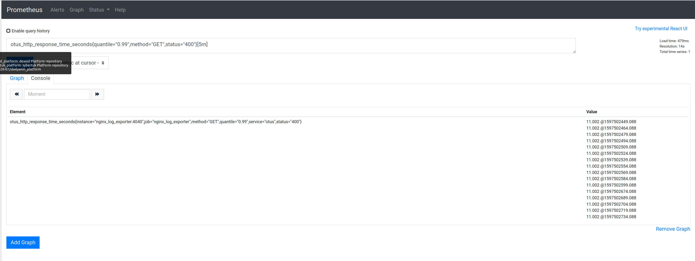
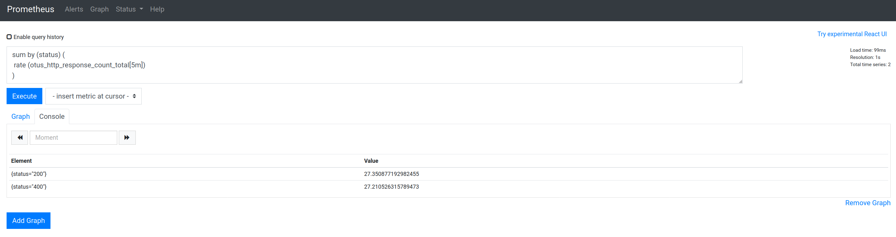

## ДЗ: Установка и настройка Prometheus, использование exporters

## Цель:

1. Необходимо собрать стенд включающий в себя 2 виртуальные машины:
   * Prometheus
   * Nginx
2. На вм с nginx установить и настроить nginx-exporter.
3. С помощью siege (или apache benchmark, или yandex tank) устроить импровизированное нагрузочное тестирование.
4. Посчитать 99й перцентиль по времени ответа за 5 минут. Посчитать количество запросов по каждому коду ответа за 5 минут.
5. Реализовать свой собственный экспортер с собственными метриками (ваше имя\никнейм в название метрики) использую любой ЯП.

### Для сдачи: 

   1. Скриншоты с Prometheus с результатами запросов PromQL
   2. Текстовый файл с примерами метрик вашего экспортера

## Решение:
1. Разворачиваем стенд  через [docker-compose](../prometheus/docker-compose.yaml)
2. Проводим нагрузочное тестирование 
~~~
cd prometheus/load_test

docker run \
    -v $(pwd):/var/loadtest \
    -v $SSH_AUTH_SOCK:/ssh-agent -e SSH_AUTH_SOCK=/ssh-agent \
    --net host \
    -it direvius/yandex-tank
~~~

3. Собираем требуемые метрики  
  

 

### Реализовать свой [собственный экспортер](./ptexp.py) с собственными метриками (ваше имя\никнейм в название метрики) использую любой ЯП.

~~~ python
import http.server
from prometheus_client import start_http_server
from prometheus_client import Histogram
from prometheus_client import Gauge
from prometheus_client import Counter

LATENCY = Histogram('av_latency_seconds',
        'Time for a request for service')

INPROGRESS = Gauge('av_inprogress',
        'Number of call in progress.')
LAST = Gauge('av_last_time_seconds',
        'The last time a call was served.')

REQUESTS = Counter('av_total',
        'Service requested.')

class MyHandler(http.server.BaseHTTPRequestHandler):
    @LATENCY.time()
    def do_GET(self):
        INPROGRESS.inc()
        REQUESTS.inc()
        self.send_response(200)
        self.end_headers()
        self.wfile.write(b"call my service")
        LAST.set(time.time())
        INPROGRESS.dec() 

if __name__ == "__main__":
    start_http_server(8000)
    server = http.server.HTTPServer(('0.0.0.0', 8001), MyHandler)
    server.serve_forever()
~~~

Результат работы 
~~~
# HELP process_virtual_memory_bytes Virtual memory size in bytes.
# TYPE process_virtual_memory_bytes gauge
process_virtual_memory_bytes 188952576.0
# HELP process_resident_memory_bytes Resident memory size in bytes.
# TYPE process_resident_memory_bytes gauge
process_resident_memory_bytes 19128320.0
# HELP process_start_time_seconds Start time of the process since unix epoch in seconds.
# TYPE process_start_time_seconds gauge
process_start_time_seconds 1597504389.27
# HELP process_cpu_seconds_total Total user and system CPU time spent in seconds.
# TYPE process_cpu_seconds_total counter
process_cpu_seconds_total 0.08
# HELP process_open_fds Number of open file descriptors.
# TYPE process_open_fds gauge
process_open_fds 51.0
# HELP process_max_fds Maximum number of open file descriptors.
# TYPE process_max_fds gauge
process_max_fds 8192.0
# HELP python_info Python platform information
# TYPE python_info gauge
python_info{implementation="CPython",major="3",minor="8",patchlevel="2",version="3.8.2"} 1.0
# HELP av_latency_seconds Time for a request for service
# TYPE av_latency_seconds histogram
av_latency_seconds_bucket{le="0.005"} 2.0
av_latency_seconds_bucket{le="0.01"} 2.0
av_latency_seconds_bucket{le="0.025"} 2.0
av_latency_seconds_bucket{le="0.05"} 2.0
av_latency_seconds_bucket{le="0.075"} 2.0
av_latency_seconds_bucket{le="0.1"} 2.0
av_latency_seconds_bucket{le="0.25"} 2.0
av_latency_seconds_bucket{le="0.5"} 2.0
av_latency_seconds_bucket{le="0.75"} 2.0
av_latency_seconds_bucket{le="1.0"} 2.0
av_latency_seconds_bucket{le="2.5"} 2.0
av_latency_seconds_bucket{le="5.0"} 2.0
av_latency_seconds_bucket{le="7.5"} 2.0
av_latency_seconds_bucket{le="10.0"} 2.0
av_latency_seconds_bucket{le="+Inf"} 2.0
av_latency_seconds_count 2.0
av_latency_seconds_sum 0.000633382995147258
# HELP av_inprogress Number of call in progress.
# TYPE av_inprogress gauge
av_inprogress 2.0
# HELP av_last_time_seconds The last time a call was served.
# TYPE av_last_time_seconds gauge
av_last_time_seconds 0.0
# HELP av_total Service requested.
# TYPE av_total counter
av_total 2.0

~~~