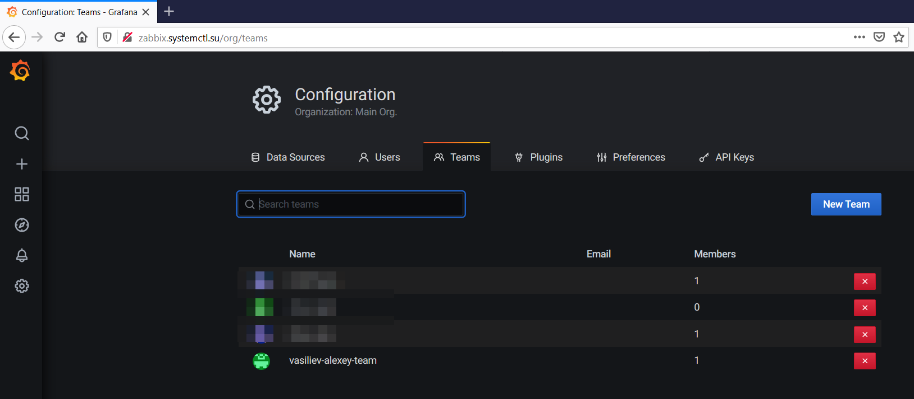
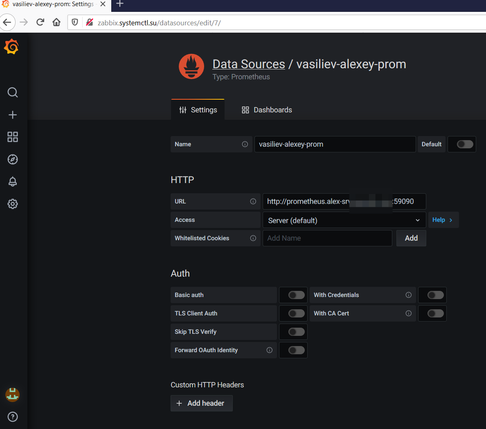

## Формирование dashboard на основе собранных данных с Prometheus

## Задание (использовать графану zabbix.xxx.su)

* создать своего пользователя
* создать свой team
* разрешить доступ к своей дашборде только своей team
* подключить свой Prometheus со своим экпортером к grafana
* создать свою папку
* создать свой dashboard на основе метрик со своего экспортера
* настроить threshold
* настроить alert в телеграм канал (указан в ДЗ про алертинг с заббикса)
* сделать снэпшот

Как результат ДЗ прислать ссылку на снэпшот, ссылку на dashboard
по просьбе преподавателя уметь пересоздать dashboard из сохраненного json 

## Решение

* создать своего пользователя - vasiliev-alexey
  

* создать свой team - vasiliev-alexey-team
  

* создать свою папку - - vasiliev-alexey-folder
  

* разрешить доступ к своей [дашборде](http://zabbix.systemctl.su/d/siESXBHGk/vasiliev-alexey-dashboard?orgId=1&refresh=10s&from=now-1h&to=now) только своей team - создана своя папка, туда помещен dashboard - выданы права на папку, от нее dashboard наследовал права доступа
  

* подключить свой Prometheus со своим экпортером к grafana - создан DataSource vasiliev-alexey-prom
  

* настроить alert в телеграм канал (указан в ДЗ про алертинг с заббикса) - настроен алерт в свой телеграмм канал

  

  

* сделать [снэпшот](http://zabbix.systemctl.su/dashboard/snapshot/PcoqoaJEmThQ9uuAY2u64jflAwvXozpH?orgId=1)

  