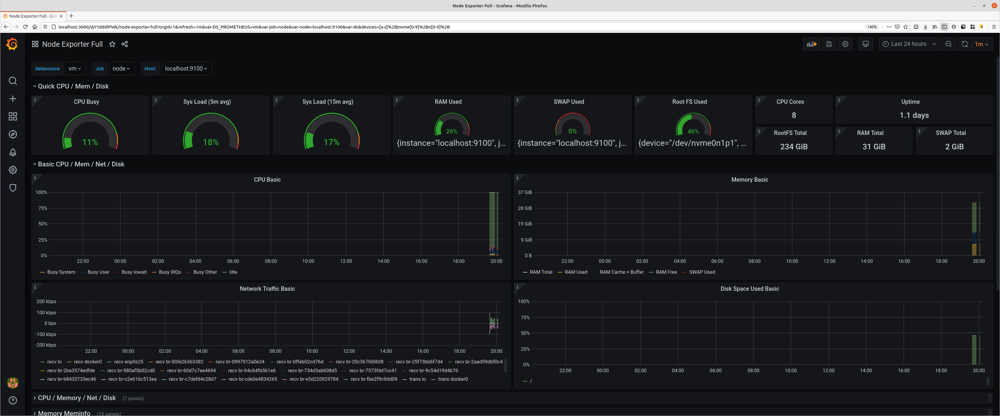

# Хранения данных в Prometheus

##
В данном дз предлагается использовать Vikotoria metrics:

* Для успешного выполнения дз вам достаточно развернуть один инстанс Viktoria metrics. При это вам нельзя использовать docker образ. Viktoria metrics должна управляться при помощи Systemd.

* Далее вам предстоит настроить remote write самого prometheus и подключить новый data source для Grafana.

* В качестве результата дз вам нужно приложить часть конфига prometheus с описанием remote write и Systemd unit file для Viktoria metrics в примечание для преподавателя. Так же приложите скриншот дашборда любого экспортера использующий в качестве datasource Viktoria metrics. 

## Установка Victoria metrics

1. Качаем бинарный файл  со [страницы релизов](https://github.com/VictoriaMetrics/VictoriaMetrics/releases)

2. Кладем его в дирреотрию и даем права на исполнение
    ~~~ sh
    chmod +x victoria-metrics-prod  
    ~~~

3. Создаем каталог для хранения данных

    ~~~ sh
    mkdir $VM/data
    ~~~

4. Можно запустить локально бинарь с передачей аргументов

    ~~~ sh
    victoria-metrics-prod -storageDataPath /lab/victoria-metrics/data -retentionPeriod 12
    ~~~

    * storageDataPath /lab/victoria-metrics/data - каталог для хранения на Storage
    * retentionPeriod 12 - период хранения в днях

5. пишем свой [Unit файл](../victoria-metrics/victoria-metrics.service)

~~~ sh
    [Unit]
    Description=victoria-metrics
    Documentation=
    After=network-online.target

    [Service]
    LimitNOFILE=65536
    ExecStart=/lab/victoria-metrics/victoria-metrics-prod -storageDataPath /lab/victoria-metrics/ -retentionPeriod 12
    KillMode=control-group
    Restart=on-failure

    [Install]
    WantedBy=multi-user.target
    Alias=victoria-metrics.service
~~~

6 . Создаем свой [стенд](../victoria-metrics/docker-compose.yaml) с Prometheus ,  Grafana и NodeExpoter

* В [конфиг](../victoria-metrics/config/prometheus.yml) Prometheus  подключаем  в качестве хранилища victoria-metrics

~~~ yaml
    global:
    scrape_interval:     15s # 
    ##  подключаем  в качестве хранилища victoria-metrics
    remote_write:
    - url: http://localhost:8428/api/v1/write

    scrape_configs:
    - job_name: 'prometheus'
        scrape_interval: 5s
    - job_name: node
        static_configs:
        - targets:
        - localhost:9100 

~~~

В [конфиг](../victoria-metrics/grafana/provisioning/datasources/all.yml) Grafana добавляем DataSource victoria-metrics

~~~ yaml
    datasources:
        - name: 'vm'
        type: 'prometheus'
        access: 'browser'
        url: 'http://localhost:8428'
        is_default: true
        editable: false
~~~

Добавим в Grafana [dasboard](../victoria-metrics/grafana/dashboards/node-exporter-full_rev21.json)

и получим результат
  
 