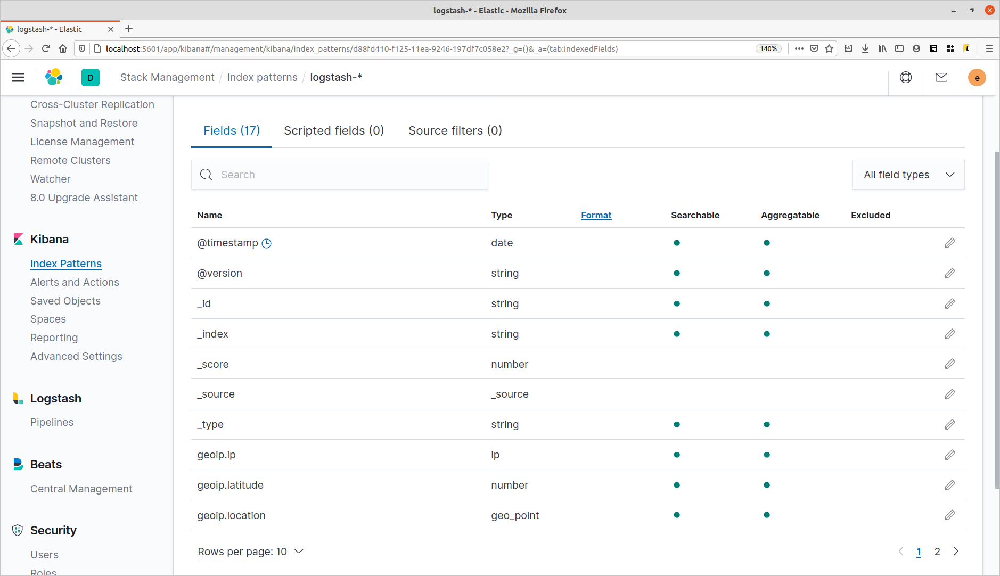

# ELK стэк

## Цель:
Для успешного выполнения ДЗ вам необходимо установить:

* elasticsearch
* logstash
* kibana

 Базовая операционная система - по вашему выбору.
 
* После успешной установки ELK стека вам необходимо настроить отправку логов в elasticsearch. Для этого вам придется изменить настройку rsyslog.
* Проверьте создался ли index в elasticsearch.
* После настройки отправки логов в ELK вам так же нужно настроить визуализацию логов от sshd.
 
В качестве результата ДЗ принимается: конфиг rsyslog, конфиг logstash.

## Решение

0. Установку пропустим - тут ничего нового нет, надо катать через Ansible Role, но  этот этап типовой - воспользуемся популярным решением  через [docker-elk](https://github.com/deviantony/docker-elk)

1. Добавляем в /etc/rsyslog.d/50-default.conf
строку 
~~~ sh
auth,authpriv.*                 @@192.168.1.50:1026
~~~

где 192.168.1.50 - ip  адрес сервера Logstash, порт 1026 , протокол TCP

Итоговый конфиг:

~~~ sh
#  Default rules for rsyslog.
#
#                       For more information see rsyslog.conf(5) and /etc/rsyslog.conf

#
# First some standard log files.  Log by facility.
#
auth,authpriv.*                 /var/log/auth.log
*.*;auth,authpriv.none          -/var/log/syslog
#cron.*                         /var/log/cron.log
#daemon.*                       -/var/log/daemon.log
kern.*                          -/var/log/kern.log
#lpr.*                          -/var/log/lpr.log
mail.*                          -/var/log/mail.log
#user.*                         -/var/log/user.log

#
# Logging for the mail system.  Split it up so that
# it is easy to write scripts to parse these files.
#
#mail.info                      -/var/log/mail.info
#mail.warn                      -/var/log/mail.warn
mail.err                        /var/log/mail.err

#
# Some "catch-all" log files.
#
#*.=debug;\
#       auth,authpriv.none;\
#       news.none;mail.none     -/var/log/debug
#*.=info;*.=notice;*.=warn;\
#       auth,authpriv.none;\
#       cron,daemon.none;\
#       mail,news.none          -/var/log/messages

#
# Emergencies are sent to everybody logged in.
#
*.emerg                         :omusrmsg:*

#
# I like to have messages displayed on the console, but only on a virtual
# console I usually leave idle.
#
#daemon,mail.*;\
#       news.=crit;news.=err;news.=notice;\
#       *.=debug;*.=info;\
#       *.=notice;*.=warn       /dev/tty8

auth,authpriv.*                 @@192.168.1.50:1026
~~~

Перезапускаем сервис
~~~ sh
systemctl restart rsyslog.service   
~~~

2. Настраиваем  Logstash

Правим конфиг  [logstash.conf](../elk/logstash/pipeline/logstash.conf)

~~~ yaml
# Входящий стрим с логами
input {
   tcp {
        port => 1026 # Порт приемник
        type => "security" 
   }
}

# Исходящий стрим с распарсенными логами в elasticsearch
output {
    elasticsearch {
                hosts => ["elasticsearch:9200"] # Хост и порт elasticsearch
                index => "logstash-%{+YYYY.MM.dd}" # Индекс в котрый пишем 
                manage_template => true
                template_name => "ssh"
                template => "/etc/ssh-map.json" # Файл с разбивкой сторки логи на состовляющие
                template_overwrite => true
				user => "elastic" # Пользователь для аутентификации
				password => "changeme" # Пароль для аутентификации
         } 
}
~~~

Создаем [файл-конфиг](../elk/logstash/config/ssh-map.json) для разбора строки лога

~~~ sh
{
    "template": "logstash-*",
    "mappings": {
        "ssh": {
            "properties": {
                "@timestamp": {
                    "type": "date",
                    "format": "strict_date_optional_time||epoch_millis"
                },
                "@version": {
                    "type": "string"
                },
                "username": {
                    "type": "string"
                },
                "src_ip": {
                    "type": "string"
                },
                "port": {
                    "type": "long"
                },
            }
        }
    }
}
~~~

3. Настриваем в ElasticSearch шаблон индекса

4. Добавялем в Kibana созданный шаблон индекса ElasticSearch
И смотрим 

---

## Материалы:  
[Инструкция по Rsyslog](https://www.elastic.co/blog/how-to-centralize-logs-with-rsyslog-logstash-and-elasticsearch-on-ubuntu-14-04)

[Еще 1 Инструкция](https://www.elastic.co/blog/grokking-the-linux-authorization-logs)

[Еще 1 Инструкция](https://devconnected.com/monitoring-linux-logs-with-kibana-and-rsyslog)

[Статья на хабре](https://habr.com/ru/post/324760/)