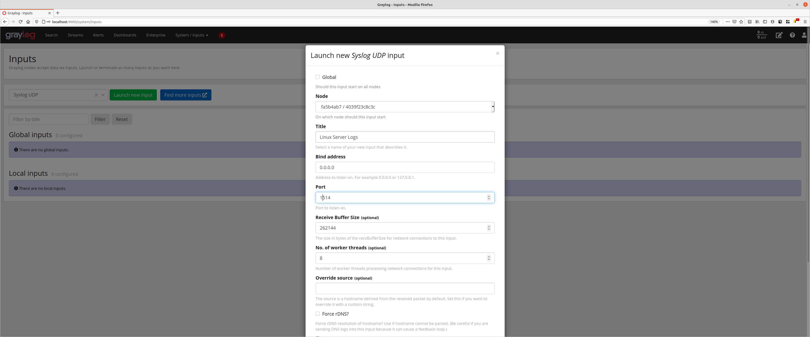
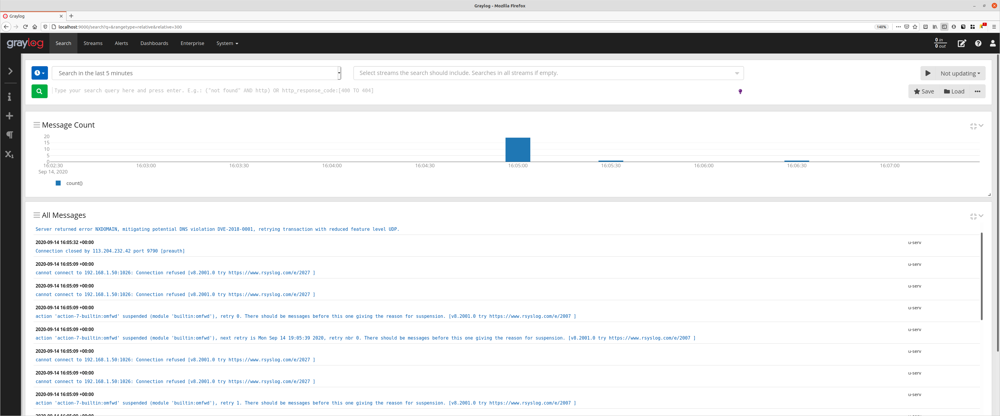

# Установка Graylog2, сбор логов

## Цель:
Для успешного выполнения ДЗ вам необходимо установить:

* elasticsearch
* graylog2
* mongo

 Базовая операционная система - по вашему выбору.
 
* После успешной установки  стека вам необходимо настроить отправку логов в elasticsearch. Для этого вам придется изменить настройку rsyslog.
* Проверьте создался ли index в elasticsearch.

 
В качестве результата ДЗ принимается: конфиг rsyslog, конфиг input graylog2.

## Решение
0. Установку пропустим - тут ничего нового нет, надо катать через [Ansible Role](https://github.com/Graylog2/graylog-ansible-role), но этот этап типовой - воспользуемся  [решением от разработчиков](https://docs.graylog.org/en/3.3/pages/installation/docker.html) docker-compose

[docker-compose.yml](../graylog/docker-compose.yml)

Запускаем, ждем пока развернется.

1. Авторизуемся admin\admin
2. Настрагиваем input

3. Конфигурируем сервер для отдачи логов в Graylog2

~~~ sh
sudo nano /etc/rsyslog.d/60-graylog.conf
~~~

~~~ sh
*.* @127.0.0.1:1514;RSYSLOG_SyslogProtocol23Format
~~~

4. Результат

## Заметки
[Сбор событий в Graylog2](https://zen.yandex.ru/media/id/5caf4eae4ef90600b49104fd/otkrytoe-reshenie-graylog-cbor-i-analiz-sobytii-v-setiah-promyshlennyh-masshtabov-5cb052ad5c891100b324e389)

[Управление логами с помощью Graylog 2](https://www.8host.com/blog/upravlenie-logami-s-pomoshhyu-graylog-2-v-ubuntu-16-04/)

[Устновка Graylog2 в Docker](https://docs.graylog.org/en/3.3/pages/installation/docker.html)