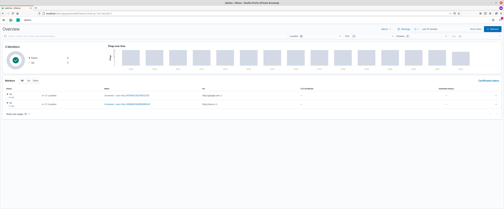
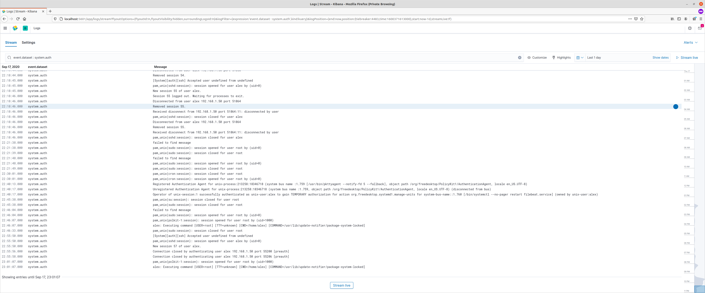
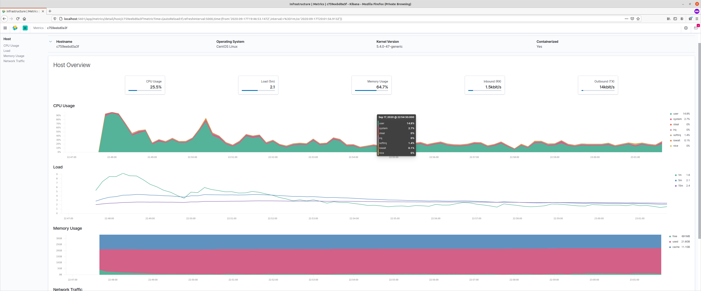

# Установка beats

## Цель: Для успешного выполнения дз вам нужно сконфигурировать hearthbeat, filebeat и metricbeat.

* Heartbeat должен проверять доступность следующих ресурсов: otus.ru, google.com.
* Metricbeat должен формировать метрики на основе показателей загрузки процессора и оперативной памяти.
* Filebeat должен собирать логи ssh сервера. По собственному усмотрению вы можете собирать логи других сервисов которые присутствуют в системе ^_^

В качестве результата приложите конфиги hearthbeat, filebeat и metricbeat. Скриншот полученных данных отображенных в Kibana.

## Решение
0 Установку на хостовую машину пропустим  - развернем через docker-compose, с помощью [репозитория](https://github.com/maxyermayank/docker-compose-elasticsearch-kibana/blob/master/docker-compose.yml)

1. C Docker и metricbeat подружить так и не получилось - с правами не разобрался, поэтому ставим [по инструкции](https://sysadmins.co.za/ship-your-logs-to-elasticsearch-with-filebeat/)  
! Ставим версию 7.8.0, так как в последней  7.9.1  - [сломали filebeat](https://discuss.elastic.co/t/filebeat-setup-isnt-working-after-update-to-7-9-0/245564/6)

* Конфигурация системного модуля [filebeat](../beats/configs/filebeat-module-system.yaml)
* Конфигурация  [filebeat](../beats/configs/filebeat.yaml)
* Конфигурация  [heartbeat](../beats/configs/heartbeat.yaml)
* Конфигурация  [metricbeat](../beats/configs/metricbeat.docker.yaml)

2. Открываем kibana и делаем скриншоты

  

  

 

## Статьи

[ELK в Docker](https://logz.io/blog/elk-stack-on-docker/)

[ELK в Docker-Compose](https://github.com/maxyermayank/docker-compose-elasticsearch-kibana/blob/master/docker-compose.yml)

[Установка и настройка filebeat](https://sysadmins.co.za/ship-your-logs-to-elasticsearch-with-filebeat/)
[Установка и настройка filebeat 2 ](https://qbox.io/blog/how-to-ship-gelinux-system-logs-elasticsearch-filebeat)

